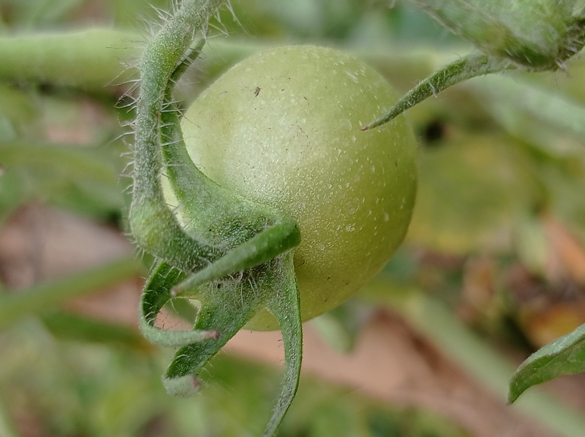
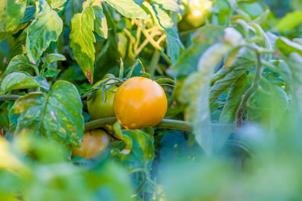
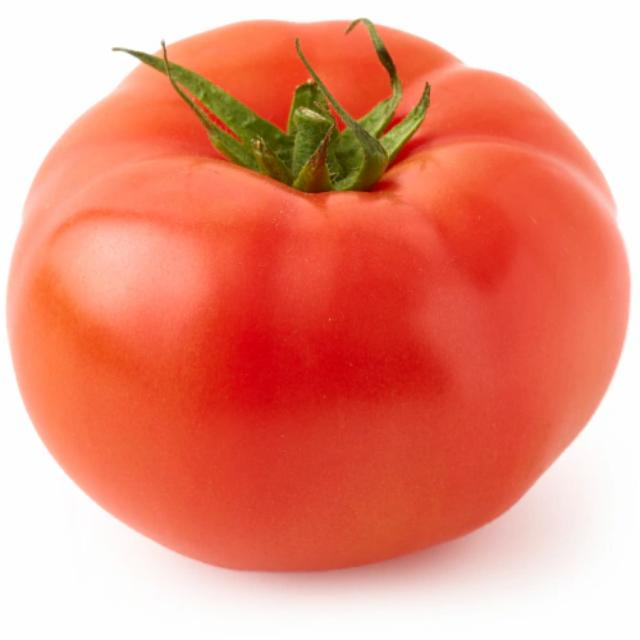
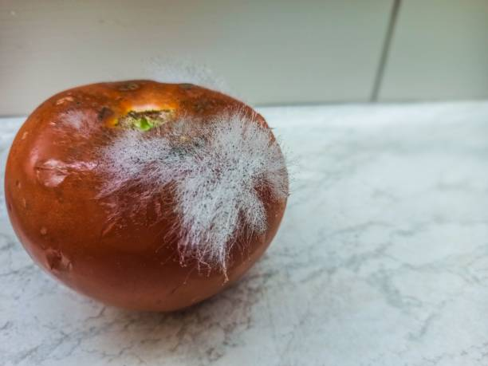

# 🍅 Tomato Ripeness Classification using Transfer Learning (MobileNetV2)

This project aims to classify the ripeness level of tomatoes (unripe, semi-ripe, ripe and reject) from images using **Transfer Learning** based on the **MobileNetV2** architecture. The model is optimized for lightweight environments such as mobile and embedded systems.

---

## 🔍 Objective

- Automatically detect the ripeness level of tomatoes from images.
- Utilize the pre-trained MobileNetV2 for efficient and accurate classification.
- Improve performance through data augmentation and fine-tuning.

---

## 🛠️ Technologies Used

- Python
- TensorFlow / Keras
- MobileNetV2 (pre-trained on ImageNet)
- Google Colab
- Mobile (android studio with kotlin)

---

## 📁 Project Structure

```plaintext
├── dataset/
│   ├── unripe/
│   ├── semi_ripe/
│   ├── ripe/
│   └── reject/
├── model/
│   └── tomato.tflite
├── tomato_classifier.ipynb
├── README.md
└── requirements.txt
```

---

## ⚙️ How to Use

1. **Clone the Repository**

```bash
git clone https://github.com/WindaPardede28/Identifikasi-Kematangan-Tomat.git
cd Identifikasi-Kematangan-Tomat
```

2. **Install Dependencies**

```bash
pip install -r requirements.txt
```

3. **Run the Notebook**
   Open `tomato_classifier.ipynb` in Google Colab or Jupyter Notebook.

---

## 🧠 Model Architecture

The model is based on **MobileNetV2**, pre-trained on the ImageNet dataset. The final layers are replaced with:

- GlobalAveragePooling2D
- Dense(128, ReLU activation)
- Dense(3, Softmax activation)

Fine-tuning is applied to the last few layers to adapt the model to tomato ripeness classification.

---

## 🖼️ Sample Dataset Images

| Imature 🍏                                   | Half-Mature 🍊                                  | Mature 🍅                                  | Rejected ❌                                |
| -------------------------------------------- | ----------------------------------------------- | ------------------------------------------ | ------------------------------------------ |
|  |  |  |  |

---

## 📊 Evaluation Results

- **Validation Accuracy**: 95%+
- **Validation Loss**: < 0.15
- **Model Size**: ~14MB (efficient for deployment)

---

## 📦 Deployment

The model can be exported to `.tflite` format and deployed on:

- Android (via TensorFlow Lite)

---

## ✍️ Author

- **Name**: Winda Sari Pardede
- **Email**: windasaripardedee@gmail.com
- **University**: Politeknik Caltex Riau
- **Department**: Informatics Engineering

---

## 📄 License

This project is licensed under the MIT License. Feel free to use, modify, and distribute it as needed.
